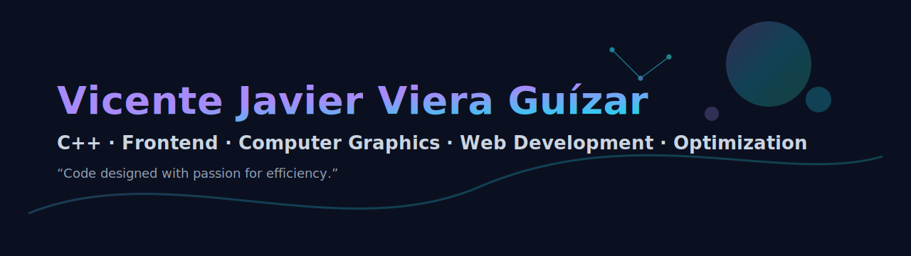

# Hello, I am Vicente! 😎
Software Engineer who enjoy low level C++ code, neat frontend and computer graphics. 👾

---

## 🎯 My Specializations
- __C++__: Architecture, efficiendy, toolchains and libraries.
- __Frontend__: Responsive and reactive UI.
- __Computer Graphics__: OpenGL, SDL2 and applied mathematics.
- __Web Development__: Full-stack, performance and infrascructure.

## 🧰 My Battle Stack

## 📊🏆 My Stats

<picture>
  <source media="(prefers-color-scheme: dark)" srcset="https://raw.githubusercontent.com/platane/platane/output/github-contribution-grid-snake-dark.svg">
  <source media="(prefers-color-scheme: light)" srcset="https://raw.githubusercontent.com/platane/platane/output/github-contribution-grid-snake.svg">
  
</picture>

_generated with [Platane/snk](https://github.com/Platane/snk)_

## 📫 Contact
- [vicenteJVG@outlook.com](mailto:vicentejvg@outlook.com)
- [Number: +52 3311782995](tel:+523311782995)
- [Personal Web Page](https://vicentejvg.netlify.app/)
- [linkedin.com/in/vicentejvg](https://linkedin.com/in/vicentejvg)
- [Reddit](https://www.reddit.com/user/plantedcoot706/)
